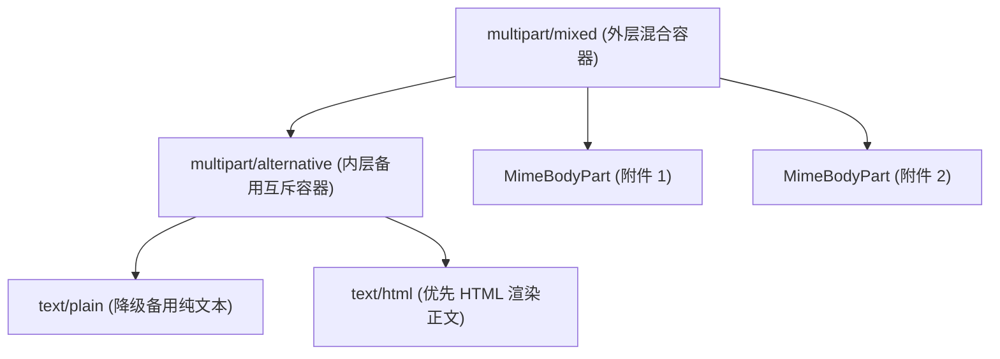

# 📬 Java SMTP 邮件发送集成与开发指南

本文档是一份结合本项目源码的 Java SMTP 邮件发送说明指南。文档共分为十个核心部分，从底层的 SMTP 协议基础开始，逐步介绍项目中各个组件的设计与实现，以便于您在生产环境中集成与应用。

---

## 🗂️ 文档目录

* **[1. SMTP 协议与连接基础 (SMTP Fundamentals)](#1-smtp-协议与连接基础-smtp-fundamentals)** —— 协议命令、端口及 `mail.properties`
* **[2. 基础邮件单发实现 (Single Mail Sending)](#2-基础邮件单发实现-single-mail-sending)** —— 资源管理与 `SendMialBySmtpDemo` 单发
* **[3. 富文本 HTML 邮件支持 (HTML Mail)](#3-富文本-html-邮件支持-html-mail)** —— MIME 支持与 `SendMialBySmtpDemo` 的 HTML 渲染
* **[4. 多收件人与抄送/密送处理 (Multiple Recipients)](#4-多收件人与抄送密送处理-multiple-recipients)** —— `MultipleRecipientsDemo` 与严格格式校验
* **[5. 附件拼接与中文名编码保护 (Attachments)](#5-附件拼接与中文名编码保护-attachments)** —— `AttachmentSmtpDemo` 与 `AttachmentMailHelper` 
* **[6. 轻量级 HTML 模板渲染 (Template Engine)](#6-轻量级-html-模板渲染-template-engine)** —— `TemplateSmtpDemo` 与 `TemplateEngine` 解析
* **[7. 统一 API 与嵌套 MIME 复合模型 (Unified MailRequest)](#7-统一-api-与嵌套-mime-复合模型-unified-mailrequest)** —— `UnifiedSmtpDemo` 与 `MailRequest`
* **[8. 适配 Amazon SES 投递 (Amazon SES)](#8-适配-amazon-ses-投递-amazon-ses)** —— `AmazonSesDemo` 与云端 SMTP 密码认证防范
* **[9. 本地开发模拟与拦截模式 (Debug / Intercept Mode)](#9-本地开发模拟与拦截模式-debug--intercept-mode)** —— `debugFlag` 离线双模调试
* **[10. 生产级高可用工程实践 (Best Practices)](#10-生产级高可用工程实践-best-practices)** —— 属性超时、SLF4J 统一日志及可见性隔离

---

## 1. SMTP 协议与连接基础 (SMTP Fundamentals)

### 1.1 SMTP 协议核心命令
SMTP (Simple Mail Transfer Protocol) 协议由客户端与服务器通过纯文本 Socket 指令进行会话交互。核心的协议交互命令如下：
* `EHLO`：客户端握手及能力协商。
* `AUTH LOGIN`：身份验证开始。
* `MAIL FROM`：声明发信人地址。
* `RCPT TO`：声明收信人地址。
* `DATA`：传输信件实体内容。
* `.`：单行单点表示数据包传输结束。
* `QUIT`：结束连接。

### 1.2 端口与加密套件
本项目中的 `SmtpClient` 支持主流的加密手段，可以通过端口和协议开关切换：
* **端口 25**：明文端口（云服务器商通常封禁）。
* **端口 465**：SSL 加密套件端口（对应 `mail.smtp.ssl.enable=true`）。
* **端口 587**：STARTTLS 升级连接端口（对应 `mail.smtp.starttls.enable=true`）。

### 1.3 属性配置加载
项目推荐使用统一的配置文件进行参数管理。以下是常用属性映射表（可参阅类路径下的 `mail.properties`）：
```properties
mail.smtp.host=smtp.example.com
mail.smtp.port=587
mail.smtp.username=your-username
mail.smtp.password=your-password
mail.smtp.starttls.enable=true
mail.smtp.ssl.enable=false
```

---

## 2. 基础邮件单发实现 (Single Mail Sending)

本部分介绍如何使用项目中的 `SmtpClient` 及 `SendMialBySmtpDemo` 类进行基础的单发邮件。

### 2.1 资源安全释放 (AutoCloseable)
邮件网络连接是非常宝贵的网络套接字资源。本项目中的 [SmtpClient.java](src/main/java/com/feilonglab/smtp/basic/SmtpClient.java) 实现了 `AutoCloseable` 接口，确保在使用完毕后，通过 `try-with-resources` 自动触发 `close()` 释放网络套接字句柄。

### 2.2 基础发送示例 (SendMialBySmtpDemo)
项目中基础发送功能集成在 [SendMialBySmtpDemo.java](src/main/java/com/feilonglab/smtp/basic/SendMialBySmtpDemo.java) 的 `sendSingleMail()` 方法中。
它采用了嵌套 `try-catch` 结构，精细地区分了连接阶段异常和邮件发送阶段的异常：

```java
import com.feilonglab.smtp.basic.SmtpClient;

// 本示例提取自 SendMialBySmtpDemo.java
public class SendSingleMailExample {
    public static void main(String[] args) {
        // 利用 try-with-resources 保证退出时自动触发 client.close() 释放资源
        try (SmtpClient client = new SmtpClient()) {

            // 步骤一：连接服务器（捕获连接错误）
            try {
                client.open();
            } catch (Exception e) {
                // 使用项目统一的 slf4j/log4j 框架输出，不混杂 System.out 打印
                System.err.println("【连接错误】无法建立与 SMTP 服务器的连接：" + e.getMessage());
                return;
            }

            // 准备单收件人基本信件内容
            String recipientName = "测试收件人";
            String recipientEmail = "recipient@example.com";
            String subject = "测试单个邮件主题";
            String content = "<h1>这是一封测试邮件</h1><p>通过 SmtpClient 成功发送！</p>";

            // 步骤二：发送邮件（捕获发送错误）
            try {
                client.sendMail(recipientName, recipientEmail, subject, content);
            } catch (Exception e) {
                System.err.println("【发送错误】单个邮件发送失败：" + e.getMessage());
            }

        } catch (Exception e) {
            System.err.println("【资源关闭错误】释放资源时发生异常：" + e.getMessage());
        }
    }
}
```

---

## 3. 富文本 HTML 邮件支持 (HTML Mail)

现代应用极少发送纯文本邮件，多以富文本（HTML）表格、图片为主。

### 3.1 MIME 类型与字符集
为了支持富文本，本项目 `SmtpClient` 底层采用 MIME 格式封包。在 `sendMail` 方法拼装正文时，显式设定了媒体类型为 `text/html`，并强制采用 `UTF-8` 字符编码：
```java
message.setContent(content, "text/html;charset=UTF-8");
```

### 3.2 HTML 发送实践
在 [SendMialBySmtpDemo.java](src/main/java/com/feilonglab/smtp/basic/SendMialBySmtpDemo.java) 中，发送的 `content` 即为一段完整的 HTML 段落：
```java
String content = "<h1>这是一封测试邮件</h1><p>通过 SmtpClient 成功发送！</p>";
client.sendMail(recipientName, recipientEmail, subject, content);
```
这保证了客户端在接收到邮件时，会根据 HTML 标记进行富文本排版渲染。

---

## 4. 多收件人与抄送/密送处理 (Multiple Recipients)

在实际业务中，常需要将一封邮件发送给多个接收者。本部分说明 TO (收件人)、CC (抄送)、BCC (密送) 的多收件人配置。

### 4.1 本项目核心实现
在 [SmtpClient.java](src/main/java/com/feilonglab/smtp/basic/SmtpClient.java) 中，通过 `setRecipients` 方法为 `MimeMessage` 分级设置多地址：
```java
// 设置主收件人、抄送人和密送人
setRecipients(message, Message.RecipientType.TO, toList);
setRecipients(message, Message.RecipientType.CC, ccList);
setRecipients(message, Message.RecipientType.BCC, bccList);
```
为了防止因为某一个邮箱格式拼写错误（如 `invalid.email@`）而导致整个发送指令被拒，程序内使用了 `InternetAddress.parse(email, true)` 的严格检测模式进行逐个解析和格式校验。

### 4.2 多群发使用示例 (MultipleRecipientsDemo)
在项目中，多收件人群发演示类为 [MultipleRecipientsDemo.java](src/main/java/com/feilonglab/smtp/multiple/MultipleRecipientsDemo.java)。示例如下：

```java
import com.feilonglab.smtp.basic.SmtpClient;
import java.util.List;

public class MultipleRecipientsApp {
    public static void main(String[] args) {
        try (SmtpClient client = new SmtpClient()) {
            client.open();

            // 准备群发收件人、抄送人、密送人列表
            List<String> toList = List.of("to1@example.com", "to2@example.com");
            List<String> ccList = List.of("cc1@example.com");
            List<String> bccList = List.of("bcc1@example.com");

            client.sendMail(toList, ccList, bccList, 
                    "【群发测试】多收件人邮件", 
                    "<h1>多收件人测试</h1><p>同时发送至 TO/CC/BCC 列表成功。</p>");
        } catch (Exception e) {
            e.printStackTrace();
        }
    }
}
```

---

## 5. 附件拼接与中文名编码保护 (Attachments)

发送报表、对账单等文件需要用到邮件附件功能。

### 5.1 mixed 混合容器复合模型
在底层封装中，带有附件的邮件，其内容媒体类型必须指定为 `multipart/mixed`。外层混合容器中包含邮件正文 `BodyPart` 以及各个附件的 `BodyPart`。

### 5.2 解决中文文件名乱码
为了防止中文字符集在不同客户端下（如 Mac 邮箱、Outlook、Gmail）显示为 `???` 乱码，项目在 [AttachmentMailHelper.java](src/main/java/com/feilonglab/smtp/attachments/AttachmentMailHelper.java) 中通过 `MimeUtility.encodeText` 进行保护转义：
```java
attachmentPart.attachFile(file);
attachmentPart.setFileName(javax.mail.internet.MimeUtility.encodeText(file.getName(), "UTF-8", null));
```

### 5.3 附件邮件发送示例 (AttachmentSmtpDemo)
在项目中，演示带附件邮件发送的类为 [AttachmentSmtpDemo.java](src/main/java/com/feilonglab/smtp/attachments/AttachmentSmtpDemo.java)。示例使用根路径下的真实文件作为测试附件载入：

```java
import com.feilonglab.smtp.basic.SmtpClient;
import com.feilonglab.smtp.attachments.AttachmentMailHelper;
import javax.mail.internet.MimeMessage;
import java.io.File;
import java.util.List;

public class AttachmentApp {
    public static void main(String[] args) {
        try (SmtpClient client = new SmtpClient()) {
            client.open();

            // 载入真实存在的测试 PDF 文件附件
            List<File> attachments = List.of(new File("src/main/resources/attachments/ShuXinJiaohuo.pdf"));

            // 1. 利用 helper 构建带附件的封装邮件
            MimeMessage message = AttachmentMailHelper.buildMessageWithAttachments(
                    client.getSession(),
                    "发件别名", "sender@example.com",
                    "收件客户", "recipient@example.com",
                    "月度对账清单",
                    "<h1>正文</h1><p>请查收下方附件。</p>",
                    attachments
            );

            // 2. 发送已构建的 MimeMessage
            client.sendMimeMessage(message);
        } catch (Exception e) {
            e.printStackTrace();
        }
    }
}
```

---

## 6. 轻量级 HTML 模板渲染 (Template Engine)

企业级邮件通知通常需要将订单数据动态渲染到 HTML 模板中。

### 6.1 高性能正则匹配器 (Regex Matcher)
为了保持 SDK 轻量，[TemplateEngine.java](src/main/java/com/feilonglab/smtp/Template/TemplateEngine.java) 没有引入 Velocity 或 Freemarker，而是基于 Java 正则表达式构建了一个单遍扫描 (Single-pass) 的高效替换引擎。
它使用编译后的 `Pattern` 对文件进行流式匹配：
```java
Pattern pattern = Pattern.compile("\\$\\{([a-zA-Z0-9_]+)\\}");
```
能够自动匹配模板中的 `${variable}` 并填充对应的值，解析出错时抛出清晰的中文 FileNotFoundException 异常。

### 6.2 模板发送示例 (TemplateSmtpDemo)
在项目中，演示模板发信的类为 [TemplateSmtpDemo.java](src/main/java/com/feilonglab/smtp/Template/TemplateSmtpDemo.java)。它渲染 `/templates/welcome.template` 模板文件并发送：

```java
import com.feilonglab.smtp.basic.SmtpClient;
import com.feilonglab.smtp.Template.TemplateEngine;
import java.util.Map;

public class TemplateApp {
    public static void main(String[] args) {
        try (SmtpClient client = new SmtpClient()) {
            client.open();

            // 准备动态参数
            Map<String, String> variables = Map.of(
                "username", "阿观",
                "email", "user@example.com"
            );

            // 渲染动态 HTML
            String content = TemplateEngine.render("/templates/welcome.template", variables);

            client.sendMail("阿观", "recipient@example.com", "欢迎加入平台！", content);
        } catch (Exception e) {
            e.printStackTrace();
        }
    }
}
```

---

## 7. 统一 API 与嵌套 MIME 复合模型 (Unified MailRequest)

对于同时需要处理多收件人、纯文本备用描述、模板和多附件的复杂发送请求，直接通过方法参数传递较为繁琐。本部分介绍项目提供的统一发送架构。

### 7.1 MailRequest 链式 DTO
[MailRequest.java](src/main/java/com/feilonglab/smtp/unified/MailRequest.java) 封装了所有的信件属性，且内置了链式 Setter (Builder-like Pattern) 供开发者优雅地组装属性：
```java
MailRequest request = new MailRequest()
    .to("user1@example.com", "user2@example.com")
    .subject("月度总账")
    .template("/templates/welcome.template", params)
    .addAttachment("report.pdf");
```

### 7.2 RFC 黄金嵌套模型
当 HTML 与纯文本同时出现在正文中时，`SmtpClient.send(MailRequest)` 实现了严苛的 RFC 标准嵌套设计。
它会将纯文本正文 `text/plain` 和 HTML 正文 `text/html` 包裹在互斥的 `multipart/alternative` 内层容器中（HTML排在后方优先渲染，不支持HTML的古老客户端则自动降级展示纯文本），然后再与外层附件 `multipart/mixed` 融为一体。树形复合嵌套模型如下：



### 7.3 一键式统一发送示例 (UnifiedSmtpDemo)
项目中对应的演示类为 [UnifiedSmtpDemo.java](src/main/java/com/feilonglab/smtp/unified/UnifiedSmtpDemo.java)。示例使用 DTO 一键式发送组合邮件：

```java
import com.feilonglab.smtp.basic.SmtpClient;
import com.feilonglab.smtp.unified.MailRequest;
import java.util.Map;

public class UnifiedApp {
    public static void main(String[] args) {
        try (SmtpClient client = new SmtpClient()) {
            client.open();

            // 使用链式 Setter 构建组合邮件请求
            MailRequest request = new MailRequest()
                    .to("to-user1@example.com", "to-user2@example.com")
                    .cc("cc-user@example.com")
                    .subject("【统一API】通知与报表交付")
                    .template("/templates/welcome.template", Map.of("username", "阿观"))
                    .textContent("降级备用信息：您的账号已激活，请及时登录。")
                    .addAttachment("src/main/resources/attachments/attachment_test.txt");

            // 一键发送，底层自动按嵌套模型装配投递
            client.send(request);
        } catch (Exception e) {
            e.printStackTrace();
        }
    }
}
```

---

## 8. 适配 Amazon SES 投递 (Amazon SES)

Amazon Simple Email Service (SES) 是业界主流的云端邮件平台。

### 8.1 切换 SES 专用配置 (mail-ses.properties)
AWS SES 在不同的地域有不同的主机 Host 域名。项目提供了 [mail-ses.properties](src/main/resources/mail-ses.properties) 模板。
要使用 AWS 邮箱，只需在构造 `SmtpClient` 时传入指定的 SES 配置文件路径即可，无需改动任何一行发送代码，实现了完美的动态切换能力：
```java
SmtpClient client = new SmtpClient("/mail-ses.properties");
```

### 8.2 IAM 秘钥与 SMTP 证书的区别（避坑重点）
> [!IMPORTANT]
> **AWS 的 IAM Access Key ID / Secret Access Key 绝不能直接作为用户名和密码填入 mail.properties！**
> 因为安全协议不同，您必须登录 AWS 控制台的 SES 页面，在 "SMTP Settings" 菜单中点击 "Create SMTP Credentials"，生成专用于邮件代理发送的特殊用户名和密码，将其填入 properties 配置文件中，否则连接将直接抛出 `535 Authentication Credentials Invalid` 认证失效异常。

### 8.3 Amazon SES 发送示例 (AmazonSesDemo)
项目中对应的演示类为 [AmazonSesDemo.java](src/main/java/com/feilonglab/smtp/amazon/ses/AmazonSesDemo.java)：

```java
import com.feilonglab.smtp.basic.SmtpClient;

public class AmazonSesApp {
    public static void main(String[] args) {
        // 直接载入 /mail-ses.properties 执行 AWS SES 专用通道构建
        try (SmtpClient client = new SmtpClient("/mail-ses.properties")) {
            client.open();

            client.sendMail("收件客户", "recipient@example.com", 
                    "SES测试邮件", 
                    "<h1>来自 Amazon SES 的测试</h1>");
        } catch (Exception e) {
            e.printStackTrace();
        }
    }
}
```

---

## 9. 本地开发模拟与拦截模式 (Debug / Intercept Mode)

在本地测试或持续集成 CI/CD 环境下，如果每次测试都向外网真实投递邮件，容易触发服务商风控判定为垃圾邮件而封号。

### 9.1 开启本地拦截配置
只要在 `mail.properties`（或任何指定的 properties 配置文件）中将拦截配置修改为：
```properties
mail.smtp.debug.flag=0
```
`SmtpClient` 将启动**调试拦截模式**：
* 客户端底层不与真实 SMTP 服务器建立任何 TCP 套接字握手连接。
* 执行 `sendMail` 或 `send(MailRequest)` 时，会正常解析渲染占位符模板，校验本地附件文件是否存在。
* 解析后的邮件完整细节（发件、收件人列表、主题、HTML内容、附件路径与状态）会直接打印在 SLF4J 格式化日志中，提供本地极速沙箱模拟。

### 9.2 本地拦截控制台日志效果展示
```text
【拦截模式】开启。模拟连接至 SMTP 服务器 smtp.gmail.com:465
【拦截模式】模拟发送统一 API 邮件详情：
  - 发件人: Fei Long Lab <testuser@example.com>
  - 收件人 (TO): [to-user1@example.com, to-user2@example.com]
  - 抄送 (CC): [cc-user@example.com]
  - 主题: 【统一API测试】包含模板与附件的邮件
  - HTML内容: <h1>欢迎你，阿观！</h1>
  - 附件列表: [attachment_test.txt (存在)]
【拦截模式】统一 API 邮件模拟发送成功。【TO: [to-user1@example.com, to-user2@example.com]】
【拦截模式】关闭模拟连接
```

---

## 10. 生产级高可用工程实践 (Best Practices)

在将 Java 邮件投递功能推向线上生产环境时，必须遵循以下高可用准则。

### 10.1 显式设定三大超时时间
千万不要使用 properties 配置的默认空值！如果网络闪断或中转服务器假死挂起，默认连接将无限阻塞调用线程，导致高并发下的业务系统因线程池枯竭直接卡死崩溃。项目在加载属性配置时提供了强制的三大毫秒级超时兜底设置：
```properties
mail.smtp.connectiontimeout=5000  # 套接字 TCP 连接建立超时
mail.smtp.timeout=5000            # 数据流读取超时
mail.smtp.writetimeout=5000       # 数据包网络写入超时
```

### 10.2 统一日志输出规范
> [!WARNING]
> 绝不要在业务代码或异常捕获中使用 `System.out.println`、`System.err.println` 甚至 `e.printStackTrace()`。
> 这种原生输出由于缺失线程标识和时间格式，无法被集中式日志平台（如 ELK 等）收集。请务必使用 `org.slf4j.Logger` 方法进行信息记录：

```java
// 错误示范：会导致日志索引平台无法采集
e.printStackTrace();

// 正确示范：带有堆栈信息的 slf4j 错误归档方法
logger.error("【发信故障】SMTP 投递失败。原因：{}", e.getMessage(), e);
```

### 10.3 控制 SmtpClient 线程生命周期与可见性
因为 `SmtpClient` 持有了底层的有状态连接对象 `Transport`，它**不是线程安全的**！
* 绝对不要在 Spring 框架中将 `SmtpClient` 设置为默认的单例单热点 Bean 供全局业务线程共享，这会导致多线程通道抢占，出现 `Transport` 冲突或状态脏读。
* **推荐做法**：使用 Prototype 原型多例作用域，或者像本项目中的 Demo 一样，在需要发送邮件的方法内部直接使用 `try-with-resources` 临时实例化客户端，用完即弃，从而在物理隔离上规避线程安全风险。
